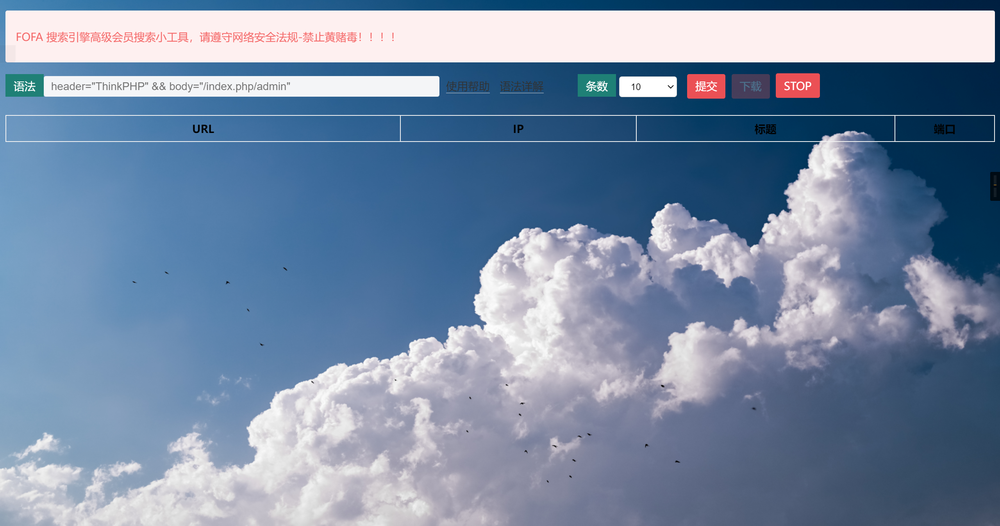

# 声明

仅供学习，禁止用于违法行为。请勿利用文章内的相关技术从事非法测试，如因此产生的一切不良后果与文章作者无关。

# 前言

关于fofa的搜索查询工具已经很多、各位大佬也已经写了很多、但是发现没有网页版的打造自己私人版本的fofa在线查询的功能（对于那种只有邮箱和key文件的人而言、自己有高级会员账户的大佬就不用喷了）、因此有了本项目的诞生。使用非常简单、自己搬来就用的那种效果。同时自己要是还想增加别的内容的话、可以自己进行修改、添加，打造属于自己的fofa在线查询。

# 环境

Linux apache php

# 用法

在自己的Apache服务器上、将所有文件放在/var/www/app目录下、

目录树如下：

```bash
root@31b255a48d5d:/var/www/app# tree
.
├── back.jpg          #网站背景图片、放在本地的话有点是速度加载的比较快
├── font-awesome.min.css
├── funckyou.js
├── function.php      #主要功能实现、配置邮箱和key文件
├── index.php
├── jquery.min.js
├── jquery.table2excel.min.js
├── layer
│   ├── jquery.min.js
│   ├── layer.js
│   └── theme
│       └── default
│           ├── icon-ext.png
│           ├── icon.png
│           ├── layer.css
│           ├── loading-0.gif
│           ├── loading-1.gif
│           └── loading-2.gif              
├── MkEncrypt.php       #加密、配置密码文件
├── page                #加密系统主要文件夹
│   ├── css
│   │   ├── bootstrap.min.css
│   │   ├── font-awesome.min.css
│   │   ├── main.css
│   │   ├── material-design-iconic-font.min.css
│   │   ├── tis.css
│   │   └── util.css
│   ├── fonts
│   │   ├── fontawesome-webfont.eot
│   │   ├── fontawesome-webfont.svg
│   │   ├── fontawesome-webfont.ttf
│   │   ├── fontawesome-webfont.woff
│   │   ├── fontawesome-webfont.woff2
│   │   ├── material-design-iconic-font.ttf
│   │   ├── material-design-iconic-font.woff
│   │   └── material-design-iconic-font.woff2
│   ├── images
│   │   └── bg-01.jpg          #加密脚本的背景页
│   └── js
│       ├── main.js
│       └── message.js
├── qr-code.jpg                 #二维码切换
└── xX3gaLMqdaBBKm85a3MGxyB6cJRH3Gc8ACcxz6J7.html          #缺点：跳转没有做来源限制、目前是增加html文件名、日后有时间修改

```


# 功能

1、fofa查询功能的实现 2、支持搜索结果的数目调增 3、支持搜索结果的自定调增 4、支持网页的加密访问

# 未来更新

修改伪加密的缺点

# 使用截图

## 加密界面


## 主页面



## 搜索

